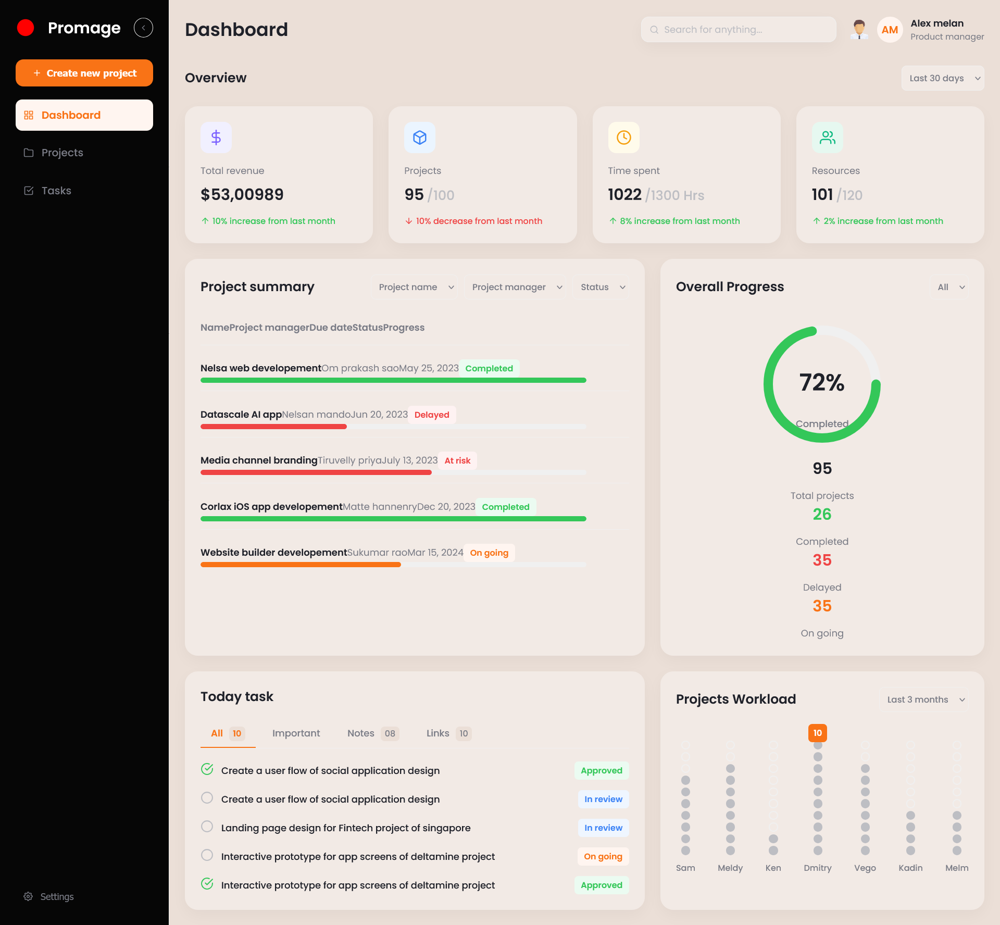

# Promage - Project Management Dashboard

A responsive frontend for a project management dashboard, built with React.js from a Figma design. This project focuses on a clean, 1:1 implementation of the design with a strong emphasis on responsive layout and purposeful micro-interactions based on established UX laws.



## Tech Stack

* **Frontend:** React.js
* **Styling:** CSS (Flexbox, CSS Grid, CSS Variables)
* **Icons:** `react-icons`
* **Charts:** `react-circular-progressbar`

---

## Getting Started

Follow these instructions to get a copy of the project up and running on your local machine.

### Prerequisites

You must have [Node.js](https://nodejs.org/) (which includes `npm`) installed on your computer.

### Installation & Running

1.  **Clone the repository:**
    ```bash
    git clone [https://github.com/your-username/lawvriksh-frontend-assignment](https://github.com/Priyanshu-Bhatt09/lawvriksh-frontend-assignment)
    cd promage-dashboard
    ```

2.  **Install dependencies:**
    This project uses a few libraries. Install them all with:
    ```bash
    npm install
    ```
    *(This will install React, `react-icons`, and `react-circular-progressbar`.)*

3.  **Run the application:**
    ```bash
    npm start
    ```
    This will open the project in your default browser, usually at `http://localhost:3000`.

---

## UX Laws Applied in This Design

The clean and intuitive feel of this dashboard is not accidental. It relies on several fundamental principles of user experience (UX) design.

### 1. Jakob's Law
**"Users spend most of their time on other sites. This means they prefer your site to work the same way as all the other sites they already know."**

* **Why it was applied:** To reduce cognitive load and make the dashboard immediately intuitive.
* **How it was implemented:**
    * **Conventional Layout:** The layout is standard for a dashboard: a primary sidebar on the left, a header with search/profile on the top right, and the main content area filling the rest of the space.
    * **Familiar Icons:** Using standard icons (e.g., `FiGrid` for Dashboard, `FiFolder` for Projects) ensures users don't have to guess what a button does.
    * **Logo Placement:** The logo ("Promage") is in the top-left, which is the most common spot and serves as a "home" button.

### 2. Fitts's Law
**"The time to acquire a target is a function of the distance to and size of the target."**

* **Why it was applied:** To make primary actions and navigation fast and effortless.
* **How it was implemented:**
    * **"Create new project" Button:** This is the primary call-to-action (CTA). It's large, high-contrast (orange), and placed in an easy-to-click position at the top of the sidebar.
    * **Navigation Links:** The "Dashboard," "Projects," and "Tasks" links are large, with ample padding, making them easy to click.

### 3. Hick's Law
**"The time it takes to make a decision increases with the number and complexity of choices."**

* **Why it was applied:** To prevent users from feeling overwhelmed and to guide them toward actions.
* **How it was implemented:**
    * **Simplified Sidebar:** The main navigation is limited to three core choices ("Dashboard," "Projects," "Tasks"), not a long list of 20 links.
    * **Task Tabs:** The "Today task" section uses tabs ("All," "Important," "Notes") to filter a potentially long list. This breaks down the information into manageable chunks, allowing the user to decide what to focus on.

### 4. Law of Proximity & Common Region (Gestalt Principles)
**"Objects that are near each other tend to be grouped together. Elements sharing an area with a clearly defined boundary are perceived as a group."**

* **Why it was applied:** To create a clear information hierarchy and make the dashboard scannable.
* **How it was implemented:**
    * **Cards:** This is the most obvious example. Each white card (`.card`) with its shadow and border-radius creates a "common region." This visually tells the user, "Everything inside this box is related." For example, the "Overall Progress" chart and its related stats are all in one card.
    * **Overview Stats:** The four `StatCard` components are grouped together in a row, signaling that they are a set of related, high-level metrics.

### 5. Miller's Law
**"The average person can only keep about 7 (plus or minus 2) items in their working memory."**

* **Why it was applied:** To ensure the information presented is digestible and doesn't overwhelm the user's short-term memory.
* **How it was implemented:**
    * **Overview Cards:** The dashboard presents **four** key overview stats, not nine or ten. This "at-a-glance" information is easily processed and remembered.
    * **Project Summary Columns:** The table shows only 5 key columns of data, not 15. It prioritizes the most essential information (Name, Manager, Date, Status, Progress).